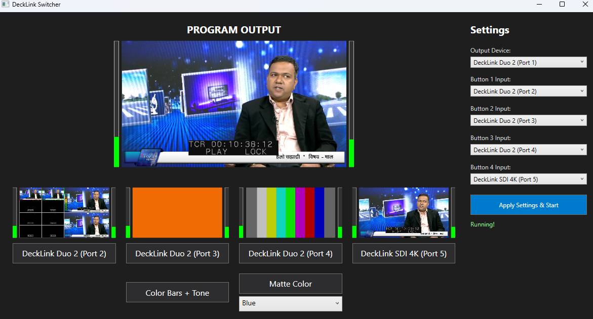

# DeckLink Switcher


A lightweight and efficient WPF application designed for Blackmagic DeckLink devices. It serves as an intuitive 4-input video switcher with built-in test signals, local media playback, and a fully featured software audio mixer.

## Features

*   **Live Video Routing:** Connect up to 4 DeckLink inputs and route them dynamically to a primary DeckLink output.
*   **Full Audio Mixer:** Includes an integrated digital audio mixer allowing you to set independent levels and mix modes (AFV, ON, OFF) for all 4 inputs, local media, and test tones.
    *   **Dynamic Local Microphones:** Automatically detects all connected local audio inputs (microphones, USB capture cards, line-in) and dynamically builds a dedicated mixing channel strip for every active device on your PC. *Includes robust audio buffering and MMDeviceEnumerator integration for full device name support without truncation.*
*   **Live Previews:** Visual previews of all 4 input sources side-by-side. 
*   **Click-to-Switch:** Easily change the program output by clicking directly on the input video previews or the corresponding input buttons below them.
*   **Local Media Playback:** Powered by LibVLC, load and play local video files (MP4, MKV, AVI, etc.) directly into the switcher's program output. 
    *   **Image Support:** Also supports routing static images (JPG, PNG, BMP) seamlessly into the broadcast.
    *   **Loop Mode:** Features a toggleable gapless playback loop for continuous playback of a selected file.
*   **Synthetic Sources:**
    *   **Color Bars + Tone:** Generate an 8-stripe SMPTE-style UYVY color bar pattern with a perfectly synchronized, phase-continuous 1kHz sine wave audio tone for calibrating equipment.
    *   **Matte Color Generator:** Send a full-screen solid matte color directly to the output. Supports on-the-fly switching between Black, White, Red, Green, Blue, Yellow, Cyan, and Magenta.
*   **System Audio Monitor:** Listen to the active PGM audio output directly through your PC's speakers, even if no DeckLink output hardware is present.
*   **YouTube Live Streaming:** Built-in direct streaming to YouTube Live via RTMP. Sends a high-quality 1080p25 H.264 stream using a bundled FFmpeg. Features automatic fallback frames to keep the stream alive when no sources are active, and *perfectly synchronized audio/video push queues to prevent A/V drift over long sessions*.
*   **Persistent Settings:** Your hardware routing, audio mixer states, levels, stream key, and system monitor preferences are continuously saved to `%APPDATA%\DecklinkSwitcher\decklink_switcher_settings.json` and restored on your next session.
*   **Robust COM Handling:** Seamlessly interfaces with the Blackmagic DeckLink SDK using Multithreaded Apartment (MTA) threading.

## Prerequisites

*   Windows operating system
*   .NET 10.0 SDK (or higher)
*   Blackmagic Desktop Video software installed (provides the required `DeckLinkAPI.dll` COM interfaces)
*   Supported Blackmagic DeckLink hardware (e.g., DeckLink Duo 2, Quad 2, 4K Extreme). *Note: The switcher can still function as a software media player and audio mixer using your PC monitor even without physical DeckLink hardware.*

## Building the Application

To build the application locally:

1. Clone this repository.
2. Ensure you have the .NET SDK installed.
3. Run the following command in the project directory:

```bash
dotnet build
```

The compiled application and its dependencies will be placed in the `bin/Debug/net10.0-windows/win-x64` directory. (A pre-compiled build is already included in this repository under that folder!)

## Usage

1. Open `DecklinkSwitcher.exe`.
2. Select your designated **Output Device** from the right-side control panel (or select "None" to just use the software previews/audio).
3. Map your physical DeckLink inputs to **Input 1**, **Input 2**, **Input 3**, and **Input 4**.
4. Click **Apply Settings**. The application will initialize the DeckLink API and start capturing feeds.
5. Click on an Input's preview image or button to route its signal to the output.
6. Use the **Local Video** section to load, cue, and play media files.
7. Use the **Audio Mixer** to adjust volume sliders and define routing rules (AFV - Audio Follows Video, ON, OFF) for each source.
8. Click the **Color Bars** or **Matte** buttons to utilize the synthetic testing feeds.
9. **Streaming:** Enter your YouTube Stream Key in the bottom right corner and click **Start Streaming** to broadcast your program output.
